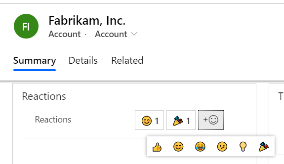
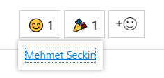
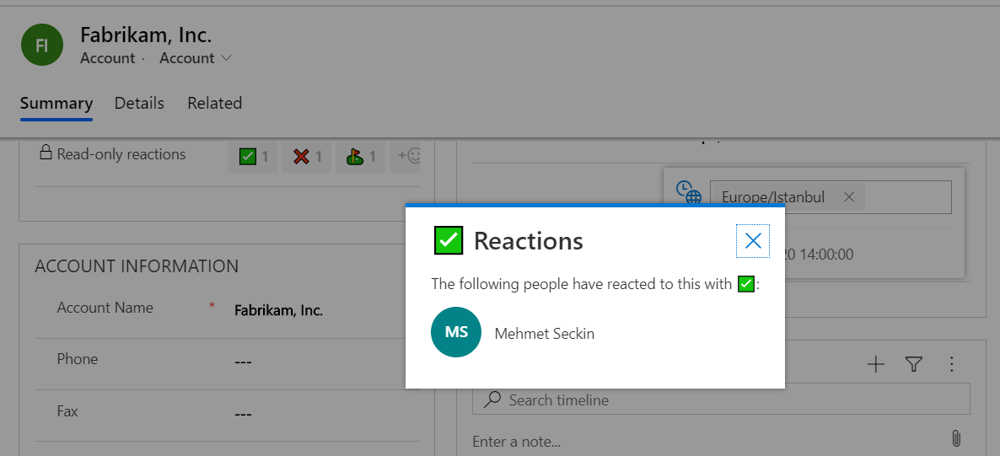
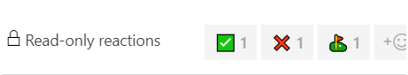

# Reactions

A set of PCF controls that add emoji reaction capabilities to Model-Driven Apps on Power Platform.

## Features

### ✅ Add/remove emoji reactions on a form

The control allows users to react to records on a form.

### ✅ Ability to configure the available emoji set

The emoji reactions available to the users are configurable on a per-control basis.

### ✅ Show a summary of reaction owners in a tooltip

When hovered over, reactions will show a summary of their owners.

### ✅ Ability to list reaction owners in a modal

The detailed list of owners for a reaction can be seen by clicking the summary in the tooltip. 

### ✅ Read-only and field security (❓) support

When the attribute is read-only, the control will not allow users to add or remove any reactions. However the owner summary and modal will still display the reaction owners.

### 💡 Ability to show reactions in a view / list of records (data-grid component)

> ⚠️ Work In Progress

### 💡 Enhance list of owners showing information like skype/teams availability, profile pictures, job title, quick message/call/email links etc.

> ⚠️ Work In Progress

## Contributing

Send a PR, open an issue, pitch some ideas, add some docs. Any feedback/contribution is appreciated.
